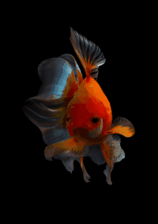

# 数字绘画光效

复现SIGGRAPH 2020论文 [Generating Digital Painting Lighting Effects via RGB-space Geometry](https://lllyasviel.github.io/PaintingLight/)

为数字绘画（自然照片也是可以的）生成重光照的效果，没有使用深度学习，很有趣的一个方法！

## 需要的第三方库

+ scipy - 用于计算凸包
+ scikit-image - 用于基础图像处理
+ taichi - 用于加速光线与凸包求交

## 使用

`python main.py --img_path <输入图像的路径> --out_path <输出的文件夹> --intensity <光源的强度> --ambient <环境光> --light_dist <光源距图像中心的距离> --light_h <光源的高度>`

程序将在`--output`指定的文件夹下生成笔画密度图以及30张用不同方向的光源生成的重光照结果图和光效图

## 效果示例

 |  | 
:---: | :---: | :---:
示例1 | 示例2 | 示例3

示例1的参数

    img_path: ./test1.png
    out_path: ./output1
    intensity: 2.0
    ambient: 0.55
    light_dist: 1300.0
    light_h: 350.0

示例2的参数

    img_path: ./test2.png
    out_path: ./output2
    intensity: 3.0
    ambient: 0.25
    light_dist: 1000.0
    light_h: 200.0

示例3的参数

    img_path: ./test3.png
    out_path: ./output3
    intensity: 3.0
    ambient: 0.25
    light_dist: 1000.0
    light_h: 100.0
